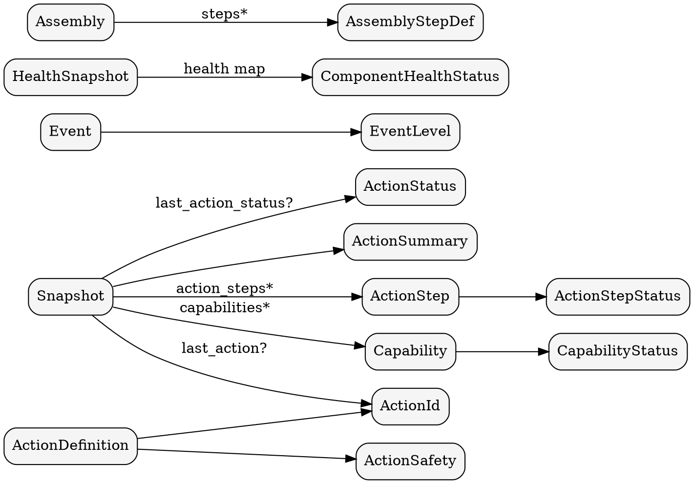

# Data Models

This section documents the core domain types used by the application,
presentation, and interface layers.

## Relationship map

## Snapshot

`Snapshot` is the aggregated runtime view.

| Field | Type | Notes |
| --- | --- | --- |
| `action` | `ActionSummary` | Assembly step counters and totals. |
| `action_steps` | `Vec<ActionStep>` | Materialized assembly steps. |
| `capabilities` | `Vec<Capability>` | Capability status list. |
| `health` | `HealthStatus` | Coarse health summary. |
| `last_updated_ms` | `u64` | Millisecond timestamp. |
| `last_action` | `Option<ActionId>` | Most recent action id. |
| `last_action_status` | `Option<ActionStatus>` | Status for last action. |

## ActionSummary

| Field | Type | Notes |
| --- | --- | --- |
| `total` | `u32` | Step count. |
| `completed` | `u32` | Steps completed. |
| `in_progress` | `u32` | Steps running. |
| `blocked` | `u32` | Steps blocked. |
| `pending` | `u32` | Steps pending. |

## ActionStep

| Field | Type | Notes |
| --- | --- | --- |
| `id` | `String` | Unique step id. |
| `kind` | `String` | Step kind (apply, delete, etc.). |
| `depends_on` | `Vec<String>` | Step dependencies. |
| `provides` | `Vec<String>` | Outputs from the step. |
| `status` | `ActionStepStatus` | Pending, Running, Succeeded, Failed, Blocked. |
| `domain` | `String` | Domain grouping. |
| `pod` | `Option<String>` | Optional execution unit. |

## Capability

| Field | Type | Notes |
| --- | --- | --- |
| `name` | `String` | Capability name. |
| `status` | `CapabilityStatus` | Ready, Degraded, Offline. |

## HealthSnapshot

`HealthSnapshot` normalizes adapter health signals.

| Field | Type | Notes |
| --- | --- | --- |
| `health` | `HashMap<String, ComponentHealthStatus>` | Component status map. |
| `last_error` | `Option<String>` | Most recent error. |
| `cache_ready` | `bool` | Whether cache is ready. |

## Assembly (definition)

`Assembly` is the adapter-normalized assembly used by the application layer.

| Field | Type | Notes |
| --- | --- | --- |
| `steps` | `Vec<AssemblyStepDef>` | Assembly step definitions. |

`AssemblyStepDef` fields:

| Field | Type | Notes |
| --- | --- | --- |
| `id` | `String` | Unique step id. |
| `kind` | `String` | Step kind. |
| `depends_on` | `Vec<String>` | Dependencies. |
| `provides` | `Vec<String>` | Outputs. |
| `domain` | `String` | Domain grouping. |
| `pod` | `Option<String>` | Optional execution unit. |
| `has_gates` | `bool` | Gate presence. |

## Event

| Field | Type | Notes |
| --- | --- | --- |
| `timestamp_ms` | `u64` | Millisecond timestamp. |
| `level` | `EventLevel` | Info, Warn, Error. |
| `message` | `String` | Log message. |

## ActionDefinition

| Field | Type | Notes |
| --- | --- | --- |
| `id` | `ActionId` | Validate, Reconcile, Rotate, Nuke, Debug. |
| `label` | `&'static str` | Display label. |
| `description` | `&'static str` | Human description. |
| `requires_confirmation` | `bool` | Whether confirmation is required. |
| `safety` | `ActionSafety` | Safe, Guarded, Destructive. |
