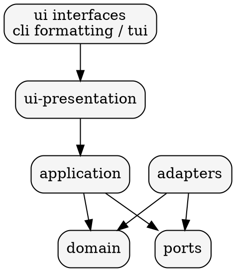
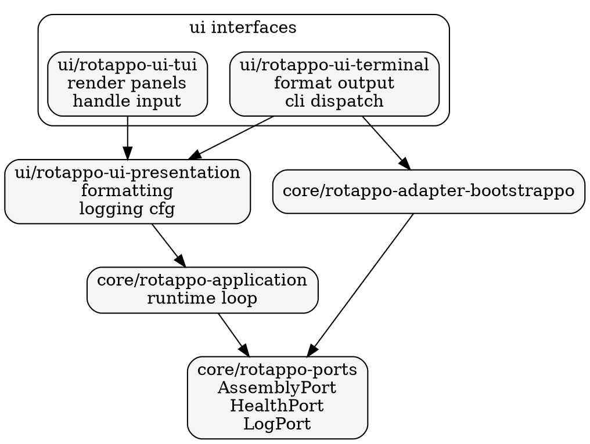

# System Architecture Diagrams

These diagrams are inline Graphviz DOT blocks. The mdbook Graphviz
preprocessor renders fenced `dot` blocks marked with `process`.

## Layered architecture (logical)

## Runtime component layout (physical)

## Port boundaries

Ports are the only surface the application layer can use to access
external data. Adapters implement those ports and normalize upstream
models into domain types.
