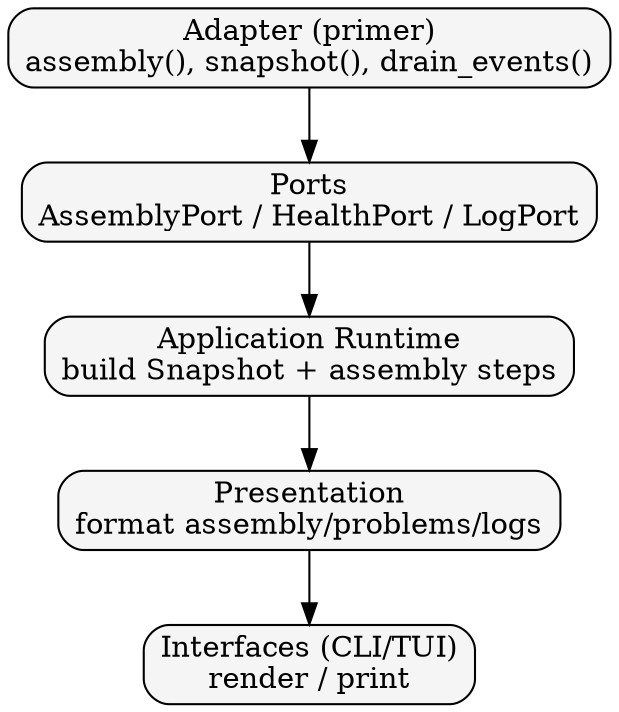

# Runtime Data Flow

This sequence shows how data flows from adapters to interfaces.

## Detailed steps

1) Adapter collects upstream data and normalizes it into domain types.
2) Ports expose the normalized data to the application layer.
3) Application builds a `Snapshot` and updates action status metadata.
4) Presentation formats the snapshot into view-friendly data.
5) Interfaces render output and handle user input.
